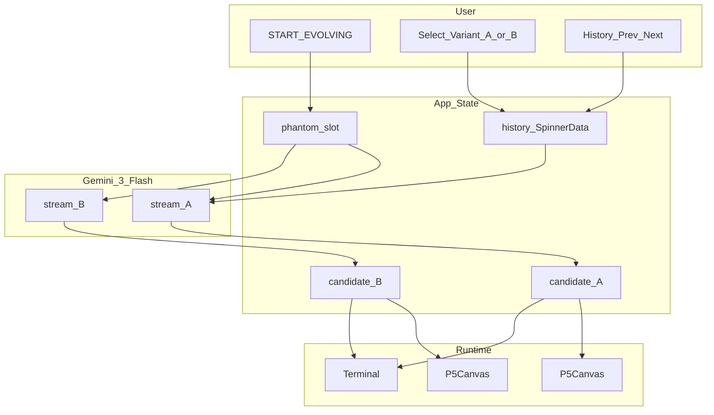
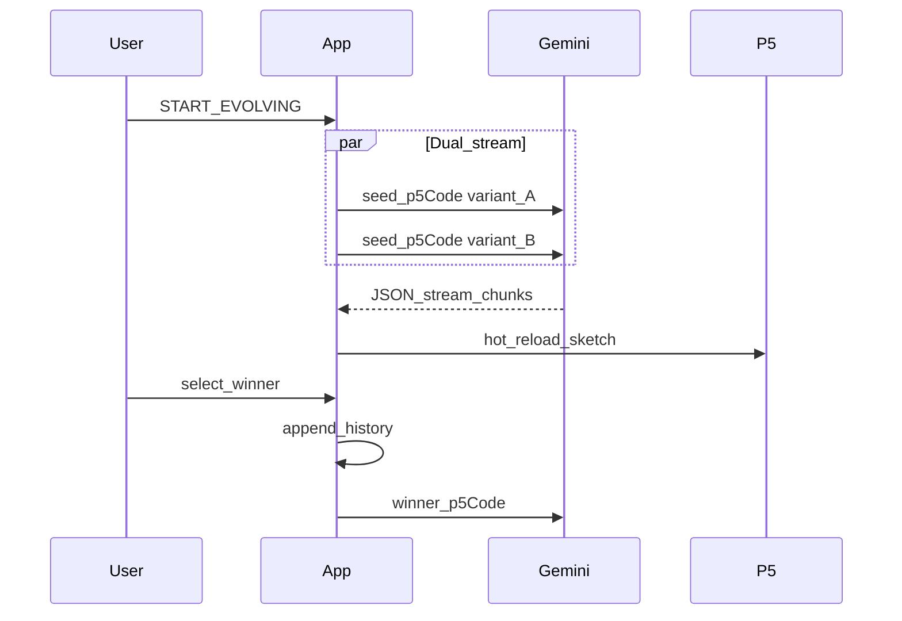
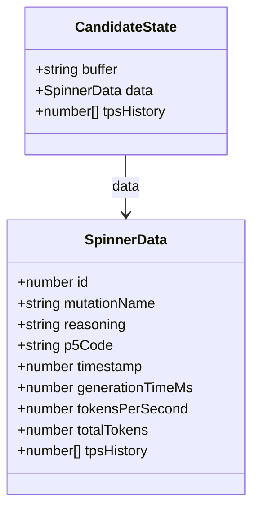
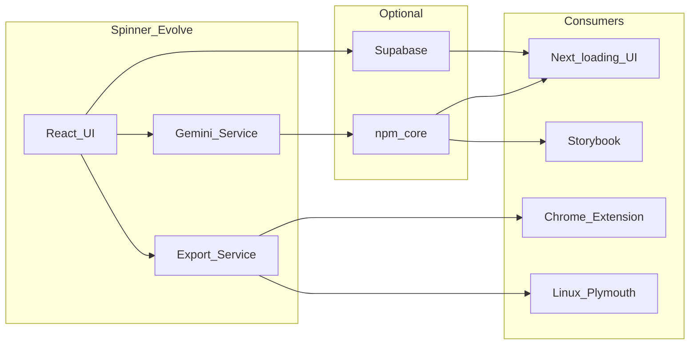

# Spinner Evolve

Evolve **p5.js loading spinners** with **Gemini 3 Flash** and human-in-the-loop **A/B selection**. Each generation produces two variants; you pick a winner, and the lineage continues from that code.

Originally built in [Google AI Studio](https://ai.studio/apps/038877a1-775d-44f2-8e65-6dfcddd1c1d0). Created by [@leslienooteboom](https://x.com/leslienooteboom).

## Architecture



| Layer | File | Role |
|-------|------|------|
| Orchestration | `App.tsx` | History, dual candidates, selection, telemetry |
| AI | `services/geminiService.ts` | Structured JSON stream (`mutationName`, `reasoning`, `p5Code`) |
| Runtime | `components/P5Canvas.tsx` | p5 instance mode via `new Function('p', code)` |
| Console | `components/Terminal.tsx` | Partial JSON, metrics, TPS chart |
| Export | `utils/exportService.ts` | ZIP packs (Windows / Linux Plymouth / Chrome) — **API ready, UI not wired** |

## Evolution loop



**State terms:** `history` = committed generations; **phantom slot** = `currentIndex === history.length` while A/B candidates are shown; **selection mode** = pick before next evolve.

## Data model



## Quick start

**Prerequisites:** Node.js, [Gemini API key](https://aistudio.google.com/apikey).

```bash
npm install
```

Create `.env.local`:

```env
GEMINI_API_KEY=your_key_here
```

Vite exposes this as `process.env.API_KEY` (see `vite.config.ts`).

```bash
npm run dev    # http://localhost:3000
npm run build  # production bundle
npm run preview
```

**Stack notes:** React 19 + Vite 6; **p5.js** loaded from CDN in `index.html` (not an npm dependency); Tailwind via CDN.

## How to use

1. Open the app → **START EVOLVING**.
2. Wait for **Variant A** and **Variant B** (live stream overlay while generating).
3. Click a canvas (or focus it and press Enter/Space) to **select** the winner.
4. Selection appends to history and starts the next dual generation automatically.
5. Use **&lt; / &gt;** to browse history; **EVOLVE** mutates from the current history item when not in selection mode.
6. In the terminal panel: expand **code stream**, download `.js` per variant.

**Mobile:** swipe or chevrons between A/B.

**Limits today:** No persistence (refresh clears lineage). `generateExportPack` and `P5CanvasRef.downloadPng` / `downloadGif` exist but have **no UI** yet.

## Project structure

```
App.tsx                 # State machine, landing, selection UI
services/geminiService.ts
components/P5Canvas.tsx
components/Terminal.tsx
components/StatsChart.tsx
utils/exportService.ts
types.ts
```

## Configuration

| Variable | Where | Purpose |
|----------|--------|---------|
| `GEMINI_API_KEY` | `.env.local` | Gemini API (mapped to `process.env.API_KEY`) |
| Model | `geminiService.ts` | `gemini-3-flash-preview` |
| Dev port | `vite.config.ts` | `3000` |

**AI constraints (prompt):** transparent canvas (`p.clear()`), seamless motion, thick strokes for **32×32 cursor** legibility, 400×400 canvas.

## Integration ecosystem



See [AGENTS.md](AGENTS.md) for skills, rules, and copy-paste prompts per integration task.

## Roadmap (summary)

### UI/UX

| # | Area | Complexity |
|---|------|------------|
| 1 | Export hub (wire `exportService` + PNG/GIF) | M |
| 2 | Lineage tree visualization | M–L |
| 3 | Branch / undo from history | M |
| 4 | Constraint panel → prompt injection | M |
| 5 | 32×32 cursor preview chip | S–M |
| 6 | History compare + code diff | M |
| 7 | Failure & retry UX | S |
| 8 | localStorage / cloud persistence | M |
| 9 | Accessibility pass | M |
| 10 | Onboarding & empty states | S |

### Integrations (stack archetypes)

| # | Integration | Complexity |
|---|-------------|------------|
| 1 | Next.js `loading.tsx` / Suspense fallback | M |
| 2 | Storybook + visual regression | M |
| 3 | `@spinner-evolve/core` npm package | M–L |
| 4 | Supabase mutation gallery | M–L |
| 5 | Vercel AI SDK dual-stream pattern | M |
| 6 | Chrome extension (export pack) | S–M |
| 7 | Playwright E2E (mock Gemini) | M |
| 8 | CI branding bot (Cursor SDK / Action) | L |
| 9 | Linux Plymouth theme | S–M |
| 10 | Full platform (Vercel + Supabase + package) | L |

## Working with AI agents

1. Open [AGENTS.md](AGENTS.md) for task routing, skills, and prompts.
2. Rules in `.cursor/rules/` auto-attach by file; `spinner-evolve-core` applies to every session.
3. **Default session prompt** (paste in Cursor chat):

   ```
   Follow AGENTS.md for Spinner Evolve. Read .cursor/rules/spinner-evolve-core.mdc.
   ```

## License

Source files use SPDX `Apache-2.0` unless noted otherwise.
